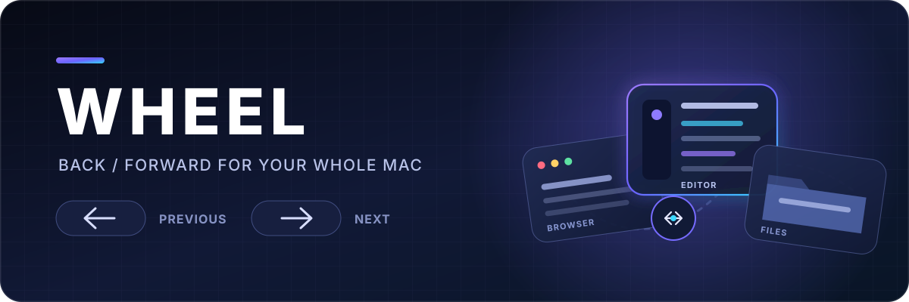
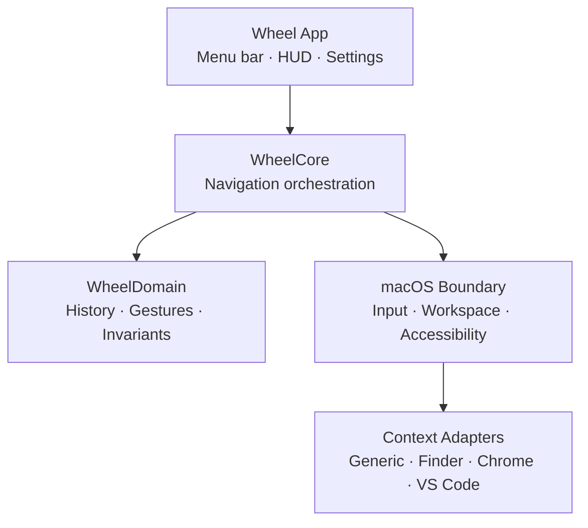

<p align="center">
  
</p>

<p align="center">
  <a href="https://github.com/gogolumo/Wheel/actions/workflows/ci.yml"></a>
  
  
  <a href="LICENSE"></a>
  
</p>

<p align="center">
  <strong>Browser-style Back / Forward navigation for your whole Mac.</strong><br />
  Wheel turns the trail of apps, windows, folders, files, and supported deep contexts<br />
  into one predictable spatial history.
</p>

> [!IMPORTANT]
> **Wheel is an early engineering prototype, not a downloadable utility yet.** The history engine, navigation invariants, tests, and demo are working. Native input capture, permissions, window restoration, and the menu-bar app are the next milestones.

## The idea

Your work is not a flat list of open apps. It is a trail:

<p align="center">
  <code>Chrome · issue</code> &nbsp;→&nbsp; <code>VS Code · source file</code> &nbsp;→&nbsp; <code>Finder · assets</code>
</p>

Wheel gives that trail a tiny system-wide grammar:

| Gesture | Meaning |
| :---: | --- |
| **LEFT** | Restore the previous global work context |
| **RIGHT** | Restore the next global work context |

No launcher grid. No radial menu. No pile of arbitrary macros. Just a consistent Back / Forward model across macOS.

## Why this is different

| Traditional app switching | Wheel |
| --- | --- |
| Shows a flat list of applications | Follows the order of your actual work |
| Makes you visually search for the target | Uses directional muscle memory |
| Usually stops at application level | Restores the deepest safe context available |
| Hides whether restoration was approximate | Reports the restoration depth honestly |
| Treats every switch as unrelated | Preserves a navigable Back / Forward trail |

## History that behaves like history

Starting with:

```text
A → B → C
```

Navigating **LEFT** to `B` keeps `C` available, so **RIGHT** still returns to it. The forward branch is replaced only if the user independently enters a new stable context after going back:

```text
A → [B] → C

independently enter D

A → B → [D]
```

Wheel never advances its internal position when restoration fails, is cancelled, lacks permission, or targets something unavailable.

## What exists today

- [x] Framework-independent `WheelDomain` module
- [x] Immutable, privacy-minimal `ContextEntry`
- [x] Deterministic Back / Forward target selection
- [x] Forward-branch preservation and replacement rules
- [x] Duplicate-current-context suppression
- [x] Explicit restoration statuses and depths
- [x] One-active-gesture-session enforcement
- [x] Unit tests for the core invariants
- [x] CLI demo for the canonical `A → B → C` flow
- [x] macOS GitHub Actions CI
- [ ] Native menu-bar application shell
- [ ] Accessibility and Input Monitoring onboarding
- [ ] Global trigger and pointer feasibility spike
- [ ] Stable application and window capture
- [ ] Generic application/window restoration
- [ ] Finder, Chrome, and VS Code adapters
- [ ] HUD, settings, persistence, signing, and beta packaging

## Architecture

Wheel is a modular monolith. Product semantics stay pure and testable; platform APIs remain behind explicit boundaries.



Application adapters may improve **how deeply** Wheel restores a context. They may never redefine what LEFT and RIGHT mean.

Read the full design in [`docs/ARCHITECTURE.md`](docs/ARCHITECTURE.md).

## Honest restoration

Wheel separates restoration **status** from restoration **depth**.

| Depth | What Wheel actually restored |
| --- | --- |
| `none` | Nothing was restored |
| `application` | The target application became active |
| `window` | The intended application window became active |
| `semantic` | A supported app-specific context was restored |

Only `success` and `partial` outcomes may move the history position. `failed`, `cancelled`, `unavailable`, and `permissionDenied` outcomes leave it untouched.

## Run the current prototype

### Requirements

- macOS 14 or newer
- Swift 5.10 or newer
- Xcode 16 or a compatible Swift toolchain

### Build and test

```bash
git clone https://github.com/gogolumo/Wheel.git
cd Wheel
swift test
swift run wheel-demo
```

To open the package directly in Xcode and run the first native feasibility
spike, see [`docs/INPUT_SPIKE.md`](docs/INPUT_SPIKE.md).

Expected demo flow:

```text
start:       A → B → [C]
LEFT:        A → [B] → C
RIGHT:       A → B → [C]
LEFT again:  A → [B] → C
new D:       A → B → [D]
```

## Roadmap

| Stage | Focus | Status |
| --- | --- | :---: |
| Foundation | Repository, modules, invariants, tests, CI | ✅ Active |
| Feasibility | Global input, permissions, window identity, restoration | **Next** |
| Native MVP | Menu bar, gesture input, stable context capture | Planned |
| Integrations | Generic fallback plus selected deep adapters | Planned |
| Productization | HUD, privacy controls, reliability, signing, beta | Planned |
| Public MVP | Signed release, checksums, limitations, support path | Planned |

The gate-driven milestone plan lives in [`docs/ROADMAP.md`](docs/ROADMAP.md).

## Privacy by design

Wheel is being designed around minimal local metadata:

- no account required
- no cloud history
- no page-body or source-code collection
- no content indexing
- bounded local retention
- application exclusions
- redacted diagnostics

The domain stores only an application bundle identifier and an opaque context token. Native capture code is responsible for keeping that token safe and minimal.

See [`docs/PRIVACY.md`](docs/PRIVACY.md).

## Product contract

These are invariants, not optional implementation details:

1. **LEFT is always previous. RIGHT is always next.**
2. **Back never destroys the forward branch.**
3. **Only independent new work replaces that branch.**
4. **Wheel-restored contexts are never recorded again as new work.**
5. **Failed restoration never corrupts history.**
6. **Only one gesture session may be active.**
7. **UP / DOWN, accounts, cloud sync, and arbitrary macros stay outside the MVP.**

## Contributing

Wheel is currently a solo-developer MVP. Focused issues and pull requests are welcome, especially around macOS feasibility, deterministic behavior, accessibility, privacy, and test coverage.

Before changing navigation semantics, read [`CONTRIBUTING.md`](CONTRIBUTING.md).

## License

Wheel is available under the [MIT License](LICENSE).

<p align="center">
  <sub>Maintained by <a href="https://github.com/gogolumo">gogolumo</a>.</sub>
</p>
