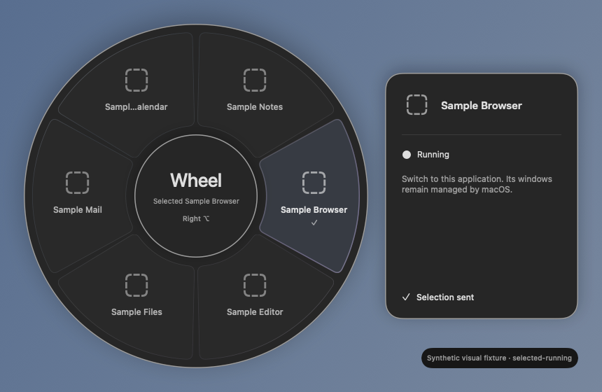
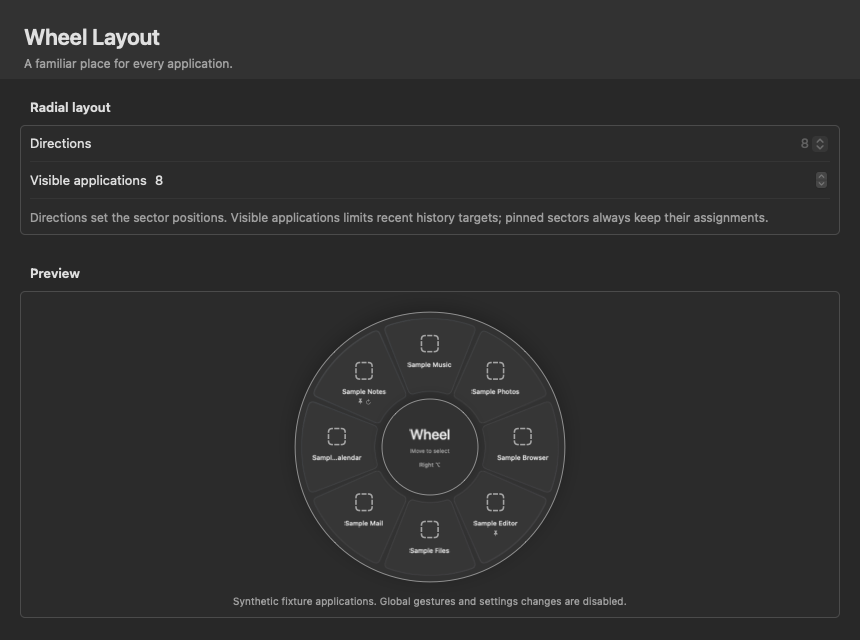
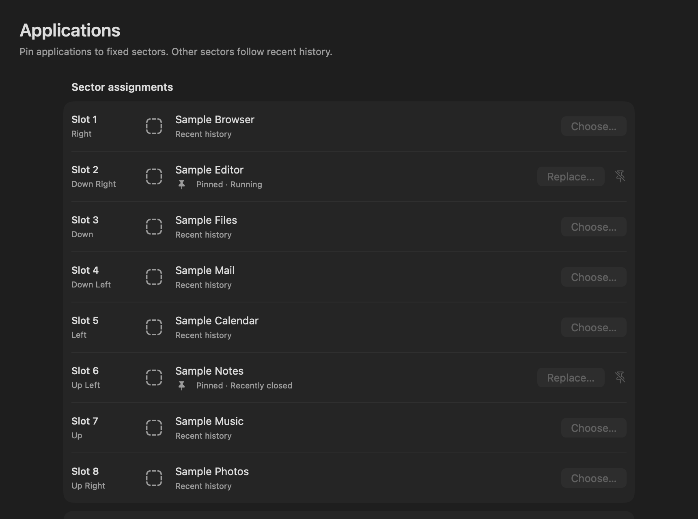
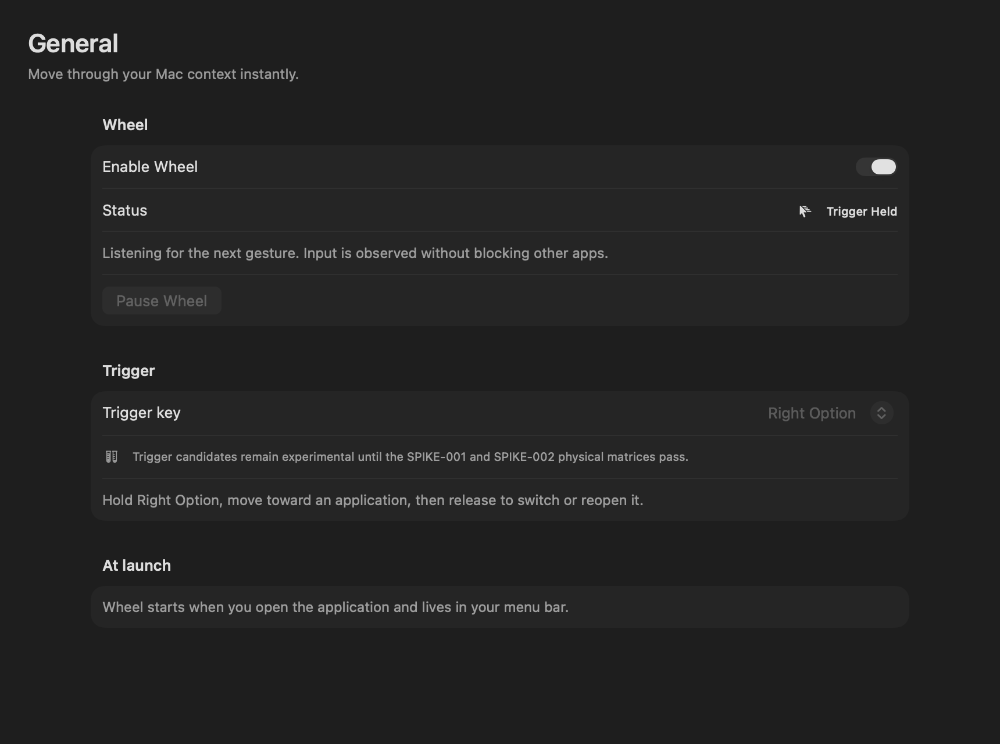
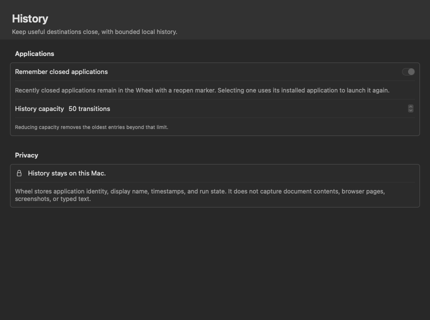
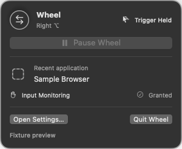
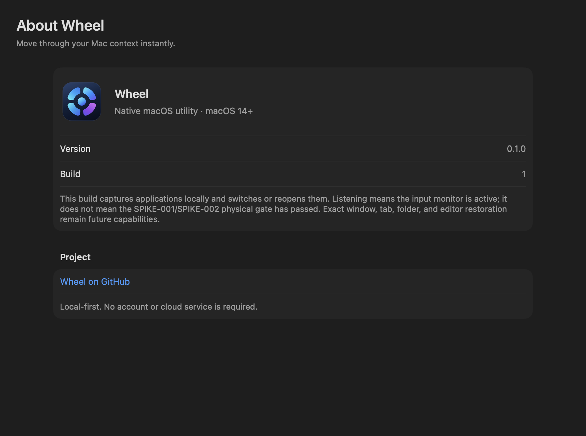
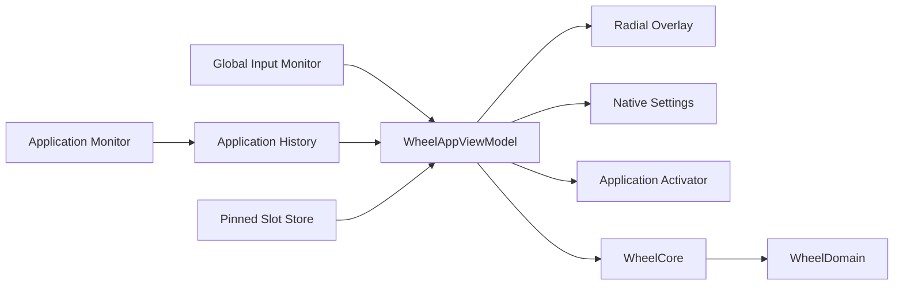

<p align="center">
  <picture>
    <source media="(prefers-color-scheme: dark)" srcset="Brand/WheelWordmark.svg" />
    <source media="(prefers-color-scheme: light)" srcset="Brand/WheelWordmarkLight.svg" />
    
  </picture>
</p>

<p align="center">
  <strong>Move through your Mac context instantly.</strong><br />
  A native, local-first utility for recent applications and pinned destinations.
</p>

<p align="center">
  <a href="https://github.com/gogolumo/Wheel/actions/workflows/ci.yml"></a>
  
  
  <a href="LICENSE"></a>
  
</p>

<p align="center">
  
</p>

Wheel is a local-first macOS utility that turns recent application activity into a fast, spatial navigation surface. Hold the configured trigger, move toward a destination in the Wheel, and release to switch to a running application or reopen a recently closed one.

> [!IMPORTANT]
> Wheel is an **early native MVP**, not a public release. The current build works at **application level**. Exact window, browser tab, Finder folder, editor file, scroll position, and unsaved-state restoration are not implemented yet. The runtime status **Listening** only means the input monitor is active; SPIKE-001 and SPIKE-002 still require full physical-Mac validation before their feasibility gates can be closed.

## What Wheel does today

| Capability | Current behavior |
| --- | --- |
| **Radial app navigation** | Shows recent destinations in a circular overlay and selects by pointer direction while the trigger is held. |
| **Running apps** | Activates a selected running macOS application. |
| **Recently closed apps** | Can retain and relaunch terminated applications when history remembering is enabled. |
| **Pinned sectors** | Lets you assign applications to fixed Wheel positions; unpinned sectors continue to use recent history. |
| **Configurable layout** | Supports 2, 4, 6, 8, 10, or 12 directions and an independent visible-application limit. |
| **Local history** | Stores bounded application identity, timestamps, and run state on this Mac. |
| **Native UI** | Menu-bar app, SwiftUI/AppKit Settings, radial HUD, native materials, and macOS 26 Liquid Glass when available. |
| **Accessibility-aware presentation** | Handles Reduce Motion, Reduce Transparency, Increase Contrast, and Differentiate Without Color. |

## See it in action

The images below are rendered by the **packaged Wheel.app** from its production view tree with isolated synthetic fixture data. They do not capture the developer's desktop, open documents, browser pages, or private app content. Native live glass/material appearance can vary by macOS version and accessibility settings.

### Radial overlay


The HUD stays nonactivating and click-through. A selected destination shows application state and the release action without pretending to expose window or document previews.

### Layout and pinned applications

<table>
  <tr>
    <td width="50%"></td>
    <td width="50%"></td>
  </tr>
  <tr>
    <td align="center"><sub>Configure directions and preview the radial layout.</sub></td>
    <td align="center"><sub>Pin applications to fixed sectors while recent history fills the rest.</sub></td>
  </tr>
</table>

### General, history, and menu bar

<table>
  <tr>
    <td width="50%"></td>
    <td width="50%"></td>
  </tr>
</table>

<p align="center">
  
</p>

<p align="center">
  <picture>
    <source media="(prefers-color-scheme: dark)" srcset="docs/assets/readme/settings-about.png" />
    <source media="(prefers-color-scheme: light)" srcset="docs/assets/readme/settings-about-light.png" />
    
  </picture>
</p>

## How it works

```text
Hold Right Option (default)
          ↓
Wheel appears after the presentation delay
          ↓
Move toward an application sector
          ↓
Release
          ↓
Activate the running app or reopen the retained closed app
```

Right Option is the default trigger. Caps Lock remains an experimental candidate. Trigger candidates are not considered physically validated until the SPIKE-001/SPIKE-002 matrices are complete.

At the domain level Wheel also preserves a Back / Forward history contract: **LEFT = previous** and **RIGHT = next**. The current radial application selector is an active product experiment layered on top of that core; it does not redefine history branching semantics.

## Features

- **Application capture** — observes normal user-facing macOS applications and keeps transient helper/system noise out of the product history path.
- **Application activation and relaunch** — switches to running apps and uses the installed app bundle to reopen retained terminated apps.
- **Pinned destinations** — choose, replace, move, or remove fixed sector assignments from **Settings → Applications**.
- **Hidden-pin retention** — reducing the direction count hides out-of-range pins without deleting them; increasing it restores them.
- **Bounded history** — configurable capacity with local persistence.
- **Native menu-bar lifecycle** — enable, pause/resume, permission recovery, recent-app status, Settings, and Quit.
- **Input Monitoring onboarding** — requests only the permission needed for the current global gesture implementation.
- **Responsive radial HUD** — one nonactivating `NSPanel`, configured for Space/full-screen auxiliary presentation, generation-guarded, and bounded to the visible screen frame.
- **Liquid Glass / Material presentation** — native macOS 26 glass when compiled with a compatible SDK, with a Material fallback on macOS 14–25.
- **Deterministic visual fixtures** — production component rendering for UI review without reading the user's real application history.

## Current scope

Wheel currently supports **APPLICATION_ONLY** capture and restoration.

**Implemented now:**

- application identity and local activity history
- radial destination presentation
- running-app activation
- recently closed app relaunch
- persistent pinned sectors
- configurable directions / visible items / history capacity
- menu-bar app and native Settings
- Input Monitoring permission flow
- sleep/wake and monitor recovery paths
- local packaging as `Wheel.app`

**Not claimed by this build:**

- exact previous window restoration
- browser-tab restoration
- Finder-folder restoration
- editor-file restoration
- scroll/cursor position restoration
- unsaved application-state restoration
- public signed/notarized distribution
- completed SPIKE-001/SPIKE-002 physical acceptance

## Install a local Wheel.app

### Requirements

- macOS 14 or newer
- Swift 5.10 or newer
- Xcode 16 or a compatible Swift toolchain

Clone the repository and build the app bundle:

```bash
git clone https://github.com/gogolumo/Wheel.git
cd Wheel
bash scripts/build-app.sh
bash scripts/verify-app.sh dist/Wheel.app
```

Install it into `/Applications`:

```bash
bash scripts/install-app.sh
open /Applications/Wheel.app
```

The package is locally ad-hoc signed. It is **not** a notarized public release yet. Do not replace an existing install with `cp -R`; use the repository installer so replacement, verification, rollback, and process checks stay intact.

To remove the local app while leaving Application Support data alone:

```bash
bash scripts/uninstall-app.sh /Applications/Wheel.app
```

## Run from source

```bash
git clone https://github.com/gogolumo/Wheel.git
cd Wheel
swift build
swift test
swift run wheel-app
```

For the repository's broader bootstrap validation:

```bash
bash scripts/bootstrap-check.sh
```

That path checks module boundaries, debug/release builds, tests, and the domain demo.

## Input Monitoring

The global trigger requires **Input Monitoring**.

1. Open Wheel.
2. Choose **Request Access** when prompted by Wheel.
3. If needed, open **System Settings → Privacy & Security → Input Monitoring**.
4. Enable the process that is actually hosting Wheel.
5. Return to Wheel and use **Check Again** if the status did not refresh automatically.

Permission attribution depends on how the app is launched:

- installed bundle → **Wheel**
- `swift run` → typically **Terminal**
- Xcode run → typically **Xcode**

Screen Recording and Accessibility are not required by the current application-only build.

## Settings

The production Settings window has eight sections:

| Section | Purpose |
| --- | --- |
| **General** | Enable/pause state, trigger, and current runtime status. |
| **Wheel Layout** | Direction count, visible application count, and radial preview. |
| **Applications** | Fixed sector assignments and retained hidden pins. |
| **History** | Closed-app retention and history capacity. |
| **Appearance** | System appearance/accessibility state. |
| **Permissions** | Input Monitoring status and recovery. |
| **Advanced** | Gesture calibration, signal counters, recovery diagnostics, and capability detail. |
| **About** | Wheel identity, version/build, and product scope. |

## Architecture

Wheel is a modular monolith: navigation semantics remain framework-independent while macOS integration stays behind explicit boundaries.


```mermaid
flowchart LR
    Input[Global Input Monitor] --> AppModel[WheelAppViewModel]
    Workspace[Application Monitor] --> History[Application History]
    History --> AppModel
    Pins[Pinned Slot Store] --> AppModel
    AppModel --> Overlay[Radial Overlay]
    AppModel --> Settings[Native Settings]
    AppModel --> Activator[Application Activator]
    Core[WheelCore] --> Domain[WheelDomain]
    AppModel --> Core
```

The domain model keeps restoration **status** separate from restoration **depth**, so application activation cannot be mislabeled as an exact window or semantic restore.

See [`docs/ARCHITECTURE.md`](docs/ARCHITECTURE.md) for module and history semantics.

## Privacy

Wheel is designed to stay local and collect the minimum metadata needed for navigation.

The current application-history path stores application identity, display name, timestamps, and run state. It does **not** capture typed text, document contents, source code, browser page bodies, screenshots, cookies, or a visual recording of the desktop.

- no account required
- no cloud history
- no AI service required
- bounded local retention
- no screen capture in the application-only build
- fixture screenshots use synthetic application identities

See [`docs/PRIVACY.md`](docs/PRIVACY.md).

## Development and testing

Useful commands:

```bash
swift build -Xswiftc -warnings-as-errors
swift test -Xswiftc -warnings-as-errors
swift build -c release -Xswiftc -warnings-as-errors
bash scripts/check-module-boundaries.sh
bash scripts/test-app-process.sh
bash scripts/build-app.sh
bash scripts/verify-app.sh dist/Wheel.app
```

Render the isolated production UI fixture set on macOS:

```bash
swift run wheel-app --render-fixtures /tmp/wheel-liquid-glass-fixtures
```

These exports verify layout/state presentation. They are **not** substitutes for physical testing of live glass, focus, full-screen Spaces, multi-display behavior, Input Monitoring attribution, or trigger hardware conflicts.

## What's next

Wheel uses gate-driven development rather than treating CI as proof of native feasibility.

- finish the SPIKE-001 global-input physical matrix
- finish the SPIKE-002 trigger-conflict physical matrix
- validate stable window identity and generic restoration
- add deeper Finder/browser/editor adapters only when supported by evidence
- complete signing, notarization, beta packaging, and clean-machine testing

Track the milestone plan in [`docs/ROADMAP.md`](docs/ROADMAP.md).

## Documentation

- [`DESIGN.md`](DESIGN.md) — production visual system and Liquid Glass behavior
- [`docs/APP_SHELL.md`](docs/APP_SHELL.md) — menu-bar shell, permissions, fixtures, and application history
- [`docs/ARCHITECTURE.md`](docs/ARCHITECTURE.md) — modules, history semantics, restoration contract
- [`docs/LIQUID_GLASS_QA.md`](docs/LIQUID_GLASS_QA.md) — fixture matrix and physical UI checks
- [`Brand/README.md`](Brand/README.md) — vector logo masters, palette, and app icon generation
- [`docs/BRAND_QA.md`](docs/BRAND_QA.md) — packaged brand checks and visual evidence
- [`docs/PRIVACY.md`](docs/PRIVACY.md) — privacy boundary
- [`docs/ROADMAP.md`](docs/ROADMAP.md) — gate-driven roadmap

## License

Wheel is available under the [MIT License](LICENSE).

<p align="center">
  <sub>Maintained by <a href="https://github.com/gogolumo">gogolumo</a>.</sub>
</p>
